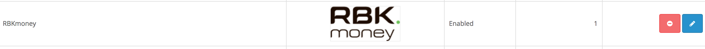

# rbkmoney-cms-opencart

Пожалуйста, обязательно делайте бекапы!

Модуль разрабатывался и тестировался на Opencart 2.1.0.2


#### Требования

- PHP 5.4 (минимум)
- OpenSSL - 1.0.2k-fips (минимум)
- Curl

#### Доступные ставки НДС для корзины

- ничего не указано - без НДС
- 0 - 0% НДС
- 10 - 10% НДС
- 18 - 18% НДС


### Установка и настройка модуля


#### Установка без архива

Для установки модуля скопируйте содержимое каталога `upload`:

```
<OpenCart>/admin/
<OpenCart>/catalog/
```


#### Установка с архивом

Заархивируйте папку `upload` в `zip` архив и переименуйте его в `rbkmoney-payment.ocmod.zip`

После чего необходимо зайти в `Extension Installer`


нажать `Upload` и выбрать архив для установки: `rbkmoney-payment.ocmod.zip`


#### Настройка модуля

В панели администратора установите и настройте его:

```
Extensions > Payments > RBKmoney нажать [Install]
```





#### Для начала приема платежей на Вашем сайте осталось совсем немного

```
Extensions > Payments > RBKmoney нажать [Edit] и заполнить необходимые настройки
```


Настройте плагин в соответствии с данными из [личного кабинета RBKmoney](https://dashboard.rbk.money).

`Shop ID` - идентификатор магазина из RBKmoney. Скопируйте его в Личном кабинете RBKmoney в разделе Детали магазина, поле Идентификатор;

`Private key` - ключ для доступа к API. Скопируйте его в Личном кабинете RBKmoney в разделе API Ключ

`Callback public key` - ключ для обработки уведомлений о смене статуса

- Заходим в личный кабинет RBKmoney: Создать Webhook;
- Вставляем в поле URL вида `http://your-site/index.php?route=payment/rbkmoney_payment/callback`, скопированного из `Notification URL`
- Выбираем Типы событий `InvoicePaid` и `Invoice Canсelled`;
- после создания Webhook-а копируем Публичный ключ после нажатия Показать детали;
- скопированный ключ вставляем в поле `Callback public key` на странице настроек модуля;


- Сохраните изменения и проведите тестовый платеж


В настройках модуля можно включить или отключить логирование `Advanced settings / Enable logs`


C ними можно ознакомиться `Tools / Error logs`


Выглядит это так:


### Нашли ошибку или у вас есть предложение по улучшению модуля?

Пишите нам support@rbkmoney.com При обращении необходимо:

- Указать наименование CMS и компонента магазина, а также их версии
- Указать версию платежного модуля
- Описать проблему или предложение
- Приложить снимок экрана (для большей информативности)


#### Возможные проблемы и их решения

1. Ошибка: FTP должен быть включен в настройках

Два варианта решения:

- Если при установке модуля из админки отображается эта ошибка - вам нужно установить бесплатную FTP QuickFix модификацию localcopy.ocmod.xml. Она установиться без проблем через тот же установщик дополнений, только после установки не забудьте обновить модификации и затем можете приступать к установке любых модулей на Opencart 2.

- Также решить эту ошибку можно по другому: прописать доступы к FTP в админке Система > Настройки > Магазин > вкладка FTP.

2. Ошибка: Доступ запрещен!

Если вы видите сообщение "Доступ запрещен!  У Вас нет прав для доступа к этой странице. Если она Вам нужна, обратитесь к администратору." -  нужно дать права администраторам на управление модулем или страницей.

Решение: в админке Opencart 2 переходим в Система > Пользователи > Группы пользователей > Администраторы и здесь нажимаем "Выделить все" ниже обоих блоков, затем Сохранить.

3. Ошибка: Недопустимый тип файла!

Если модуль - это один XML файл,  то его расширение должно быть .ocmod.xml

Если модуль - это ocmod.zip архив, то его не нужно распаковывать, а устанавливать как есть. В таком архиве обязательно должна быть папка upload (может быть пустой), а также могут быть файлы модификаций: install.xml, install.php, install.sql. Никаких других файлов в корне архива быть не должно.

Читайте подробнее как [устанавливать модули в Opencart 2](https://opencart2x.ru/blog/install-module)


4. Ошибка: Каталог, содержащий файлы для загрузки не может быть найден!

Эта ошибка означает, что в загружаемом архиве отсутсвует папка upload. Даже если у модуля нет файлов, кроме модификаций - эта папка должна присутствовать в архиве модуля .ocmod.zip, тогда она должна оставаться пустой.

5. Ошибка: Модификатор использует тот же ID код который вы пытаетесь загрузить!

Эта ошибка означает, что вы пытаетесь установить модификатор, который уже установлен или, возможно, у какого-то вашего модуля такой же ID.

Для решения этой ошибки вам нужно перед установкой удалить старую версию модификации в разделе Модули > Модификации.

Если такого модуля у вас нет, но совпадает ID, тогда нужно поменять значение параметра `<code>` в устанавливаемом модификаторе XML, сделать этот параметр уникальным дописав несколько символов.

6. Ошибка: `Warning: DOMDocument::loadXML(): CData section not finished`

Эта ошибка означает, что вы пытаетесь установить слишком объемный xml-модификатор.

Количество символов в `ocmod.xml` файле не должно превышать 65535.

Для решения ошибки нужно разбить xml-файл модификации на несколько частей, главное - не забыть задавать каждой уникальное значение в `<code>`, можно добавлять к текущему значению цифры 1,2,3... как идентификаторы части.

Еще одним способом решения есть изменения типа в поля, где храняться модификации, в таблице `'oc_modification'` базы данных. Нужно выполнить следующий SQL-запрос:

```
ALTER TABLE oc_modification CHANGE xml xml MEDIUMTEXT CHARACTER SET utf8 COLLATE utf8_general_ci NOT NULL ;
```
